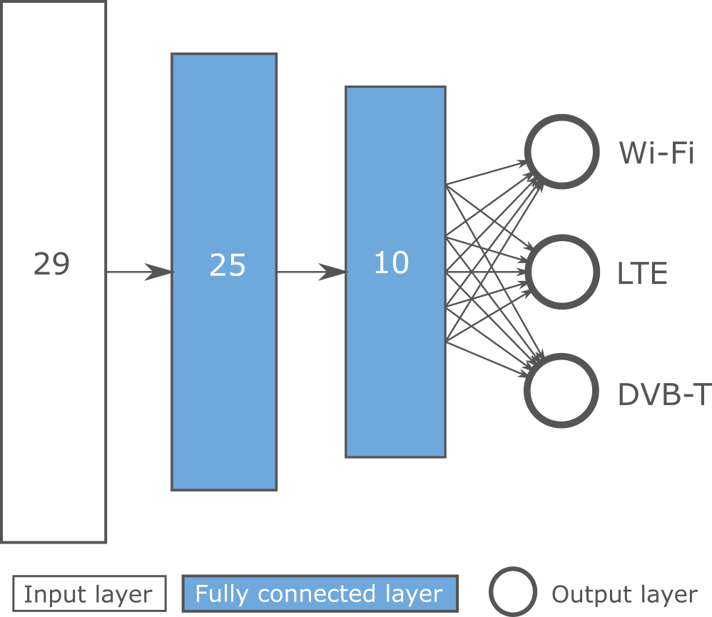

# RSSI-based-OFDM-signal-classification

Due to limited licensed bands and the ever increasing traffic demands, the mobile communication industry is striving for offloading licensed bands traffic to unlicensed bands. A lot of challenges come along with the operation of **LTE in unlicensed bands while co-locating with legacy Wi-Fi operation** in unlicensed band. In this co-existing environment, it is imperative to **identify the technologies** so that an intelligent decision can be made for maintaining quality of service (QoS) requirement of users.

Next to this unlicensed co-existing environment, a second concern is the sharing of the licensed bands where **DVB-T** operates. This is called **white space reuse**. The reuse factor used in DVB-T systems leads to unused spectrum at a given location. Users can opt to use this spectrum if and only if no DVB-T transmission is present and they transmit using less power than TV broadcast stations. It is thus necessary to periodically **sense if the spectrum is unused** by the primary user or other secondary users. On the other hand the primary user, the TV broadcast stations, will want to detect if there is illegal **use of their licensed spectrum** at the time they want to use it.

## Manual feature extraction vs autonomous feature learning
Wireless technology identification can be implemented in multiple ways. We decided to use **machine learning techniques**, given many recent breakthroughs and success in other domains. Furthermore, it allows learning identifying wireless technologies on its own by giving it data. How we captured this data is described in the next section.

We consider two techniques for machine learning: one where we **manually extract features** using export knowledge and one where we give raw RSSI data to the machine learning model. The second technique exploits the **autonomous feature learning** capabilities of neural networks.

We manually extracted the following features:
- **r0,r1,...,r19** are 20 intervals selected from the input histogram. *r0* corresponds with the most left part of the histogram with *frequency > 0*, while *r19* represents the most right part of the histogram with *frequency > 0*.  Each interval thus contains 5\% of the histogram and its value resembles the frequency of RSSI values within the corresponding interval.
- **minR** is the minimum RSSI value with *frequency > 0* and thus the left boundary of the histogram.
- **maxR** is the maximum RSSI value with *frequency > 0* and thus the right boundary of the histogram.
- **nP** is the measured amount of peaks in the histogram.
- **wP** is the width of the highest peak.
- **stdHist** is the standard deviation of the histogram values.
- **stdData** is the standard deviation of the RSSI values upon which the histogram is calculated.
- **meanData** is the mean of the RSSI values upon which the histogram is calculated.
- **medianData** is the median of the RSSI values upon which the histogram is calculated.

Manually feature extraction allows **faster signal classification**, but requires expert knowledge. The autonomous feature learning model is more **flexible** because it adapts to new situations given enough useful data. Using complex DNN models also allows slightly **higher accuracy** (98%) than manual feature selection methods (97%).

## Dataset description
We used **two datasets** that are part of the eWINE project.

The first dataset, used for training, was captured at various locations in Ghent, Belgium. The dataset can be found [here](https://github.com/ewine-project/Technology-classification-dataset).

A second dataset, used for validation, was captured at Dublin, Ireland. The dataset can be found [here](https://github.com/ewine-project/lte-wifi-iq-samples).

## Model description
The **models** for both manual and automatic feature extraction **are present** in *manual feature extraction/rssilearningmanual.m* and *automatic feature learning/neuralnetworkautomatic.m* respectively. Manual feature extraction uses the features as described before as input, while automatic feature extraction uses **256 RSSI values** which are derived from 16 IQ samples per RSSI value. The neural **network architecture** of the manual model can be seen below.

## Contact
For further information, you can contact me at jaron.fontaine@ugent.be.
